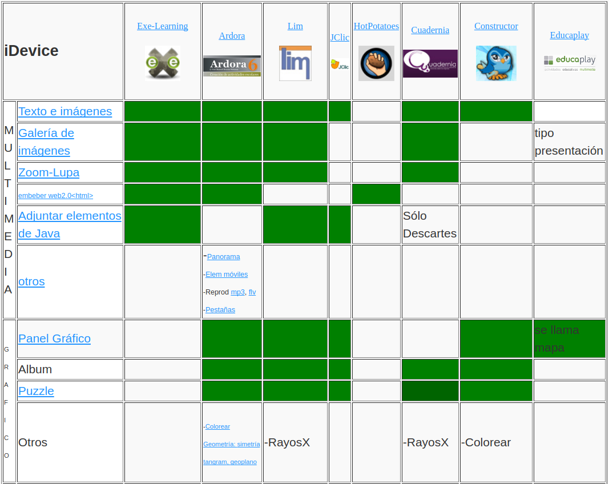
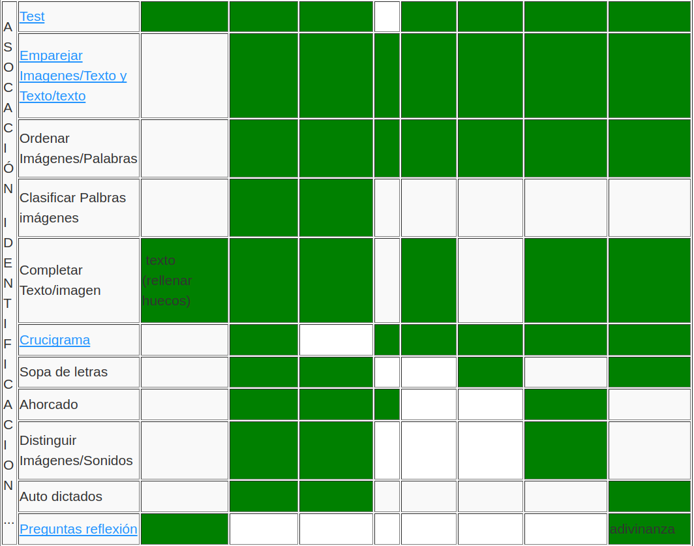
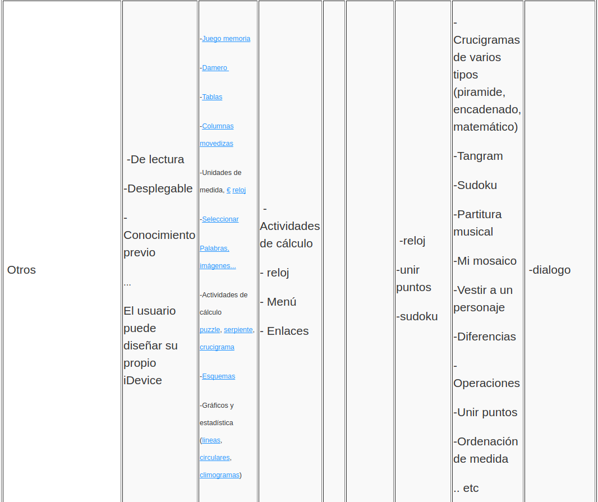

# Actividades

No existe una forma estandar de referirnos a un tipos de actividad o **iDevice.** De hecho, en este módulo encontrarás frase del tipo *"En educaplay el Panel gráfico se llama actividad con mapa".*

En el módulo 1, ya nos referimos a esto, exlicando que entendemos por algunos tipos de actividades.

En la tabla, resumimos qué actividades se pueden hacer con cada aplicación. 

[Tabla con enlaces](http://aularagon.catedu.es/materialesaularagon2013/herramelabor/zips/Modulo_3/actividades.html")

# Caso práctico

¿En qué afecta todo esto a mi elección?

Imaginemos que tengo alumnos de 6º de primaria ó 1º de ESO ¿Qué tiene que ver con la herramienta a elegir?

%accordion%Solución%accordion%

# Retroalimentación

No son los mismos ejercicios los que se plantean en estos niveles que en 1º de bachillerato, por ejemplo.

Quizá para los de 6º ó 1º quiera preparar test, preguntas de relacionar, crucigramas, etc. y entonces HotPotatoes es muy buena opción.

Para los mayores, quizá preparo otro tipo de ejercicios, más parecidos a los de "reflexión" con realimentación y puede que me interesen más eXeLearning o educaplay.

%/accordion%

# Esto es un lio: recomendamos ver ejemplos

Hemos ido poniendo ejemplos de actividades **una a una**. Pero es interesante ver colecciones de actividades variadas. A modo de ejemplo, en los enlaces, tienes algunos ejemplos de Lim, Cuadernia, Constructor, Ardora o Clic:

- [Lim](http://www.educalim.com/lim32ej/lim32ej.html)
- [Constructor](http://constructor.educarex.es/odes/primaria/conoc/DE_PASEO_POR_MI_CUERPO/index.html)
- [JClic](http://clic.xtec.cat/db/jclicApplet.jsp?project=http://clic.xtec.cat/projects/awarhol/jclic/awarhol.jclic.zip&amp;lang=ca&amp;title=Andy+Warhol)
- [Ardora](http://webardora.net/axuda_cas.htm)

