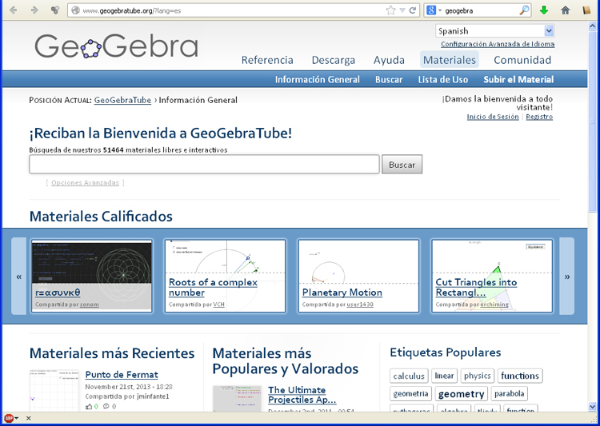

# Actividades descargables

GeoGebra dispone de una librería de recursos elaborados que se llama [GeoGebraTube](http://www.geogebratube.org/). Desde allí es posible buscar y descargar actividades hechas con GeoGebra.

Podemos registrarnos en GeoGebraTube, con nuevo registro o con nuestro usuario y contraseña de google y otras redes sociales.

**Una vez registrados podemos descargar las actividades** de diderentes formas. Las dos que nos pueden intesar son:

- Archivo GeoGebra (.ggb). A diferencia de las otras tres no precisa registro . La podremos abrir con la aplicación GeoGebra.
- Hoja de Trabajo Fuera de Línea (.zip). Una vez descomprimida se ejecuta en un navegador.

GeoGebraTube tiene esta interfaz:

<td style="text-align: center;">Fig. 4.8. GeoGebraTube</td>

