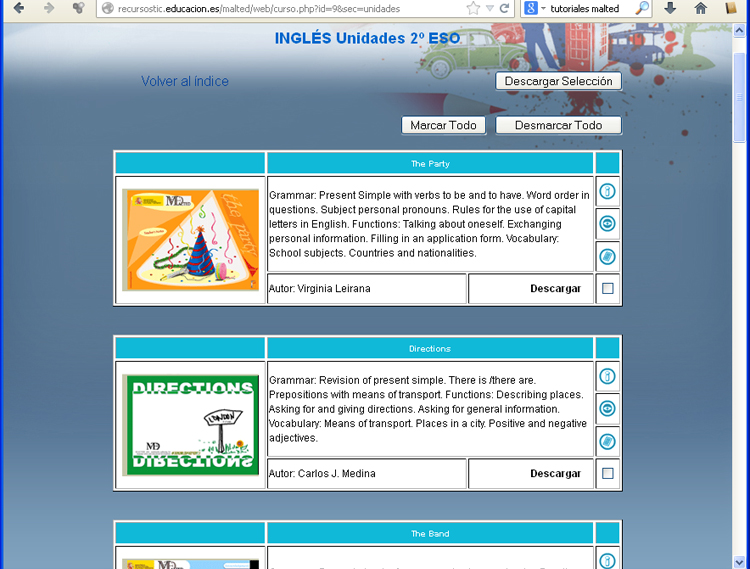
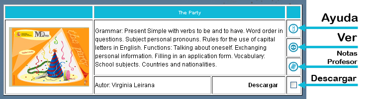

# Actividades MALTED

En la web de Malted es posible descargar gran cantidad de actividades. Para ello en [la Web de inicio de Malted](http://recursostic.educacion.es/malted/web/) vamos a **Materiales didácticos**. Vamos a suponer nos interesa: Ingles 2º de ESO. Iríamos a [**Materiales didácticos&gt;Inglés Secundaria&gt;2º ESO**](http://recursostic.educacion.es/malted/web/curso.php?id=9&amp;sec=unidades), y se abre una página como esta:

<td style="text-align: center;">Fig 4.30. Librería de recursos MALTED</td>

Al inicio de la web hay un botón: 

Antes de pulsarlo, deberemos haber marcado que unidades queremos descargar. Para ello en cada unidad, hay varios botones (Ayuda, Ver  y Notas de Profesor), y una casilla que es la que debemos marcar para descargarla:

<td style="text-align: center;"> Fig 4.31. Actividad MALTED</td>

 Los otros botones, permiten:

- **Ayuda**: Instrucciones para usar la unidades
- **Ver**: Para ver la unidad on-line. **SOLO SI HAY VERSIÓN ADECUADA DE JAVA**
- **Notas del Profesor**: Archivo pdf con indicaciones para el profesor.

Cuando seleccionamos las unidades que queremos y pulsamos a  , nos redirige a otra página en la que nos informa que va a bajar un archivo: instalar.jar

Este archivo **instalar.jar,** lo ejecutaremos y nos instalará la actividad que luego podremos ejecutar con MaltedWeb2.0, al pulsar en **MI EQUIPO**.

<td style="text-align: center;">   Fig 4.32. Navegador Malted</td>

 

 

