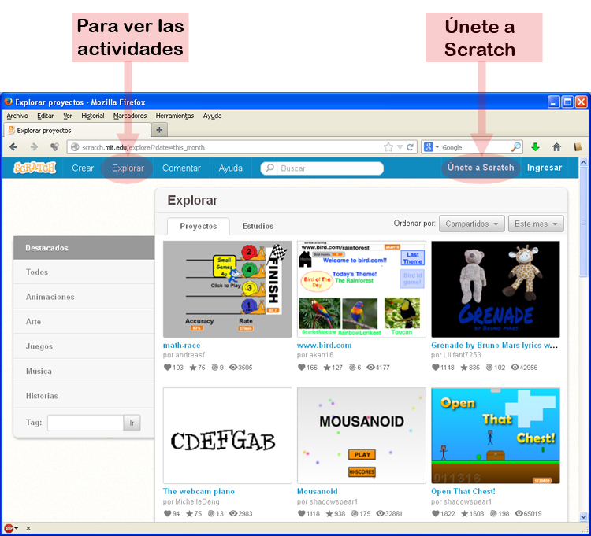
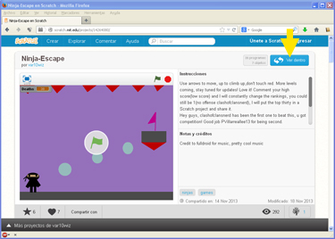
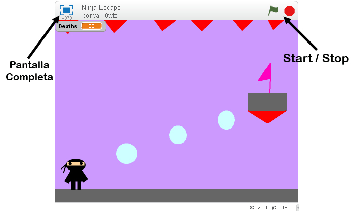

# Actividades SCRATCH

Una vez en la web de inicio de Scratch, [vamos a la sección Explorar](http://scratch.mit.edu/explore/?date=this_month), donde hay gran cantidad de actividades que podemos probar y reprogramar.

<td style="text-align: center;">Fig. 4.12. Actividades de SCRATCH y acceso a usuarios</td>

En **Únete a Scratch** podemos registrarnos como miembros de la comunidad Scratch para poder compartir los proyectos que elaboremos.

Como vemos, los proyectos se clasifican en Animaciones, Arte, Juegos, Música o Historias. Tambien podemos buscar actividades por "Tag", es decir, etiquetas que los autores han dado a sus actividades.

Para ejecutar una actividad, hacemos doble clic en ella y se muestra.

Parte de la filosofía de Scratch, se basa en poder modificar, mejorar o reinventar un proyecto ya hecho. Para ello, cuando estamos viendo una actividad, el botón **Ver dentro** (marcado en la imagen con la flecha amarilla), nos permite ver la programación de la actividad, y cuando estamos viendo la programación, pulsando **Ver página del proyecto **(marcado en la imagen con la flecha verde), volvemos a ver sólo el proyecto.

<td colspan="2" style="text-align: center;">Fig. 4.13. Vista de actividad / Vista de programación</td>

Las actividades comienzan a funcionar cuando pulsamos la **bandera verde** de Start y se para con el **circulo rojo** de Stop (a la derecha en la imagen siguiente). Podemos visualizarlas a pantalla completa pulsando en el botón de la izquierda.

<td style="text-align: center;">Fig 4.14. Aspecto de un juego/proyecto SCRATCH</td>

Las actividades, se pueden compartir e incrustar en nuestra web, copiando y pegando un código html,

La siguiente animación creada con SCRATCH, está incrustada a modo de muestra:

<iframe frameborder="0" height="402" src="http://scratch.mit.edu/projects/embed/2317992/?autostart=false" style="display: block; margin-left: auto; margin-right: auto;" width="485"></iframe>

