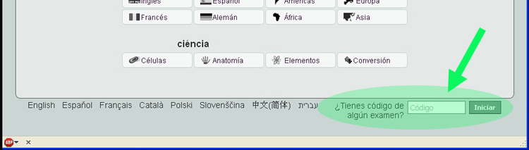

# Actividades ThatQuiz

Cada "botón" de la página de inicio coresponde a un tipo de actividad. En la imagen marcamos "Potencias"

<td style="text-align: center;">Fig. 4.19. Botones de diferentes actividades</td>

Se abre la actividad, y el aspecto es el de la siguiente imagen. Como vemos el aspecto es muy **minimalista**. En el panel izquierdo podemos ir eligiendo los diferentes tipos de ejercicios.

<td style="text-align: center;">Fig. 4.20. Actividad ThatQuiz</td>

En el panel derecho está **el marcador**, con aciertos, errores o tiempo. La primera vez que damos a **OK** empieza a correr el tiempo y el marcador va reflejando los aciertos y fallos.

Lógicamente, además de estas actividades, los usuarios registrados pueden crear la suyas que se comparten a traves de un código que se genera al elaborar la actividad. Dicho código se introduce en la casilla preparada para ello al pie de la web de inicio de ThatQuiz

<td style="text-align: center;">Fig. 4.21. Casilla código de actividad</td>

