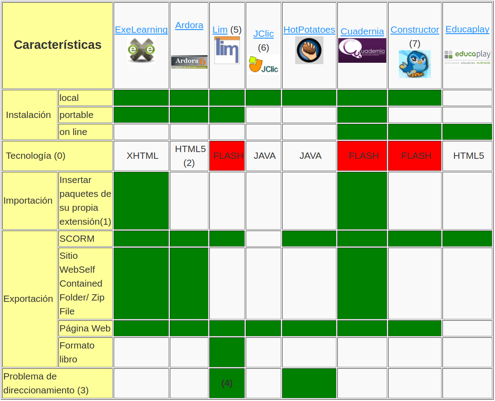

# Caraterísticas Generales

Tratamos de resumir en esta tabla, las diferencias/similitudes de cada herramienta en función de sus características. Es decir, tipo de instalación, tecnología que usan, formatos de exportación, etc.

(0) La tecnología mejor es la que no crea problemas en los navegadores por seguridad ni plugins que luego hay que configurar en los ordenadores de los alumnos, a nuestro criterio las mejores son dos HTML5 y XHTML.

**Las tecnologías Flash tienen el riesgo de quedar obsoletas [[ver](http://www.elmundo.es/blogs/elmundo/el-gadgetoblog/2017/07/25/adobe-acabara-con-flash-en-2020-10-anos.html)] por lo tanto NO LO RECOMENDAMOS**.

(1) esta característica es muy útil pues permite exportar una parte del paquete a un fichero de la misma naturaleza o extensión que el paquete original e importarlo en otro paquete distinto, con lo cual nos permite reutilizar actividades y modularizar los contenidos.

(2) Antiguamente era Java, actualmente es HTML5. Su autor es Jose Manuel Bouzan.

(3) El problema del direccionamiento consiste en que los recursos hay que tenerlos grabados previamente en la misma carpeta donde se hace la actividad, es mejor que no este marcado ese cuadro.

(4) Técnicamente LIM corrige el direccionamiento pero en su interfaz está diseñada para tener antes todos los recursos en la una carpeta.

(5) A lo largo del curso se utilizará el nombre de **LIM** o **EDILIM** indistintamente. Su autor es Fran Macías.

(6) JClic fue de las primeras herramientas de autor. Su entorno y sus requisitos técnicos la hacen poco amigable, se necesita un programa JPlayer para visualizar en los alumnos las actividades JClic y la herramienta de autor del profesor JPlayer es complicada. Es un clásico y existen numerosas actividades realizadas con esta herramienta.

(7) A lo largo del curso se utilizará el nombre de **Constructor** o **Atenex** indistintamente.

# Caso práctico

**¿Cómo me sirve esta información para tomar mi decisión?**

Imaginemos que en mi centro tengo miniportátiles de la escuela 2.0, que están congelados. ¿afecta esto a mi decisión?

%accordion%Solución%accordion%

# Retroalimentación

Pues muy posiblemente, **si**. Imaginemos que queremos usar JClick que funciona en Java y además precisa una configuración de seguridad de Java mínima, configuración que tendrás que hacer ordenador a ordenador y que además si está congelado no se guardará.

Por tanto, a causa de Java no te tecomendamos usar esta tecnología.

%/accordion%

Me gusta la idea de hacerlo todo on-line ¿Qué herramienta elijo?

%accordion%Solución%accordion%

# Retroalimentación

Pues **educaplay** puede ser la respuesta. Es on-line, las actividades quedan publicadas conforme las acabo y además es html5, la tecnología más estandar, con lo que bastará un navegador actualizado para funcionar.

%/accordion%

