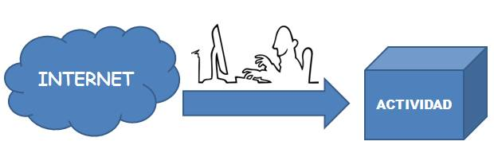
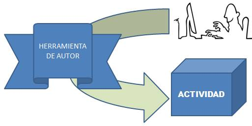

# ¿Cómo lo conseguimos?

Evidentemente hay dos formas de conseguir las actividades:

- Que alguien anteriormente las haya creado y nosotros nos beneficiamos. El camino usual es Internet

- O crearla nosotros, para ello utilizamos algún programa que nos facilita la creación de la actividad, es decir UNA **HERRAMIENTA DE AUTOR**. La gran mayoría de las herramientas de autor no precisan conocimientos elevados de informática.

**NO TENGO TIEMPO !!!! ** seguramente lo pierdes en Internet, lee esta historia:

 

## La tortuga y la liebre

¿cual es el método más rápido? esta pregunta fue la que les plantee a todo un claustro de un centro en una actividad formativa.

Todos suponían que el método de descargar algo creado era más rápido que crearlo uno mismo.

Se dividió el claustro en dos:

- Grupo A: buscaron en Internet una actividad para un concepto y un nivel elegido por ellos anteriormente.
- Grupo B: crearon la actividad con una herramienta de autor para ese mismo concepto y nivel **sin tener conocimientos previos de esta herramienta de autor**

Tenían 30 minutos ¿Quien ganó?

<input class="feedbackbutton" name="toggle-feedback-373_9" onclick="$exe.toggleFeedback(this,true);return false" type="button" value="Mostrar retroalimentación"/>

### Retroalimentación

El resultado del grupo A de Internet fue frustante. En Internet es verdad que hay cosas buenas, pero para un concepto y nivel concreto ya es más difícil, la mayoría del grupo no encontraron algo de calidad para aplicarlo en clase de forma inmediata.

Yo ayudé al grupo B a realizar la actividad con la herramienta de Autor, elegí Ardora (sencillo, fácil), realizaron todos la actividad a su medida y gusto, perfectamente preparada para aplicarla a los alumnos el día siguiente.

