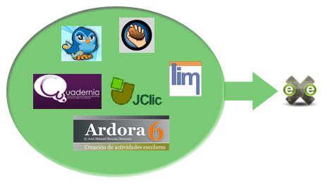

# Con eXeLearning

En **eXeLearning**, hay diferentes posibilidades de **integrar** actividades. Podemos:

- **Crear un link** o enlace a una actividad que tengamos alojada por ejeplo en dropbox o drive
- Lo mismo que el enlace pero con el **iDevice Sitio web externo**.
- Insertar el **iDevice applet de Java**, como vimos en el módulo 2 (recomendable con JClic)
- **Insertar una actividad como iframe**, e incorporarla a nuestro proyecto

Nos vamos a centrar en este último apartado, ya que los otros ya los vimos en el módulo de eXeLearning.

<td style="text-align: center;">Fig. 5.6. Integrar en eXeLearning</td>

 

 

