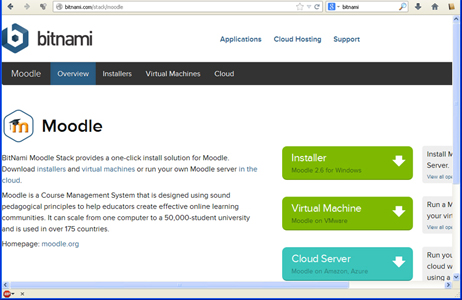
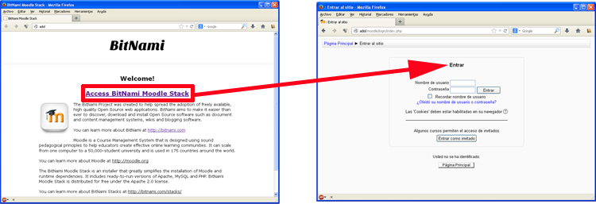

# Con SCORM+Moodle

Si en tu centro hay instalado un moodle propio, pregunta al administrador si es posible que te de de alta un curso para alojar objetos SCORM. **El manejo será similar a lo que vimos en el caso de Moodle en Internet.**

Dependiendo del tipo de instalación, la actividad quedará instalada en red local o si el centro lo tiene tambien configurado para dar servicio en internet, tu actividad quedará publicada también en Internet.

## ParaSaberMas

En el caso de que queramos configurar nuestro propio moodle, un pack muy interesante lo proporciona [BitNami](http://bitnami.com/stack/moodle). De esta web podemos descargar el instalador.

<td style="text-align: center;">Fig. 5.11. Página de Descargas del Moodle de BitNami.</td>

Durante la instalación es importante, cuando el  instaldor lo pida, proporcionar al sistema un usuario y contraseña, que deberemos recordar para poder configurar nuestro Moodle.

Para arrancar, en el menú de inicio, se instala el grupo de programa de la instalación de Moodle y debemos ejecutar Launch Bitnami Moodle Stack, y se abre sobre el navegador la página de la izquierda y al pulsar Access BitNami Moodle Stack, se abre la página de acceso:

<td style="text-align: center;"> Fig. 5.12. Inicio de Moodle con la instalación local de BitNami.</td>

Pondremos el usuario y contraseña que hemos facilitado en la instalación, y ya accedemos como administrador a Moodle.

A partir de allí podremos, cambiar el idoma a castellano, dar de alta los cursos, crearlos como SCORM, etc.

