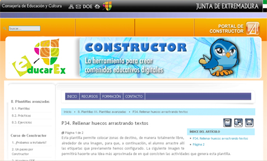

# Constructor NO RECOMENDADO

Constructor, ya sea ejecutado desde la versión descargada o desde la versión on-line, funciona de forma análoga.

Tiene una característica que puede resultar molesta o anti-intuitiva, que es la gestión de los archivos, pero que con el tiempo resulta funcional, y que es la **gestión de archivos**. Lo que hace constructor, es obligarnos a subir los materiales a utilizar, imagenes, videos, audios, etc. con un **Gestor de Archivos**.

Es decir, antes de iniciar la elaboración del panel gráfico, o la actividad que sea, debemos tener previstos todos los archivos en los que nos vamos a apoyar y subirlos.

Entonces, **para hacer el panel gráfico** con constructor:

1. Abrimos un nuevo ODE y le damos un nombre
1. Vamos al gestor de archivos y subimos la imagen que usaremos a nuestro ODE. No es especialmente intuitivo.
1. En el panel de recursos, verificamos si está nuestra imagen, en el apartado Imágenes.
1. En el panel de recursos, vamos a Plantillas
1. De las plantillas, elegimos: **"Rellenar huecos arrastrando textos"**
1. Se abre un configurador o asistente, que debemos completar.
1. Una vez concluido el asistente, a la derecha se colocan las etiquetas y a la izquierda los huecos. Los huecos los debemos llevar sobre la imagen al lugar adecuado y las etiquetas las disponemos como deseemos.
1. Guardamos los cambios
1. Y vamos al botón vista previa para ver cómo queda la actividad.

Lo que hemos guardado, ya sea on-line o local, no lo tenemos disponible digamos en una carpeta de nuestro ordenador. Por eso para **poder disponer del ODE creado debemos descargarlo**. Para ello, vamos de nuevo al Gestor, pero ahora a Gestor&gt;Objeto Digital Educativo... Se abrirá un asistente, en el cual buscaremos nuestro ODE y pulsaremos en el botón descargar. Bajará comprimido, pero descomprimiendo y buscando index.html, podremos ejecutarlo.

Veamos cómo hacer tódo esto:

<object data="http://aularagon.catedu.es/materialesaularagon2013/herramelabor/tm3/PG_constructor.swf" height="600" style="display: block; margin-left: auto; margin-right: auto;" type="application/x-shockwave-flash" width="800"><param name="src" value="http://aularagon.catedu.es/materialesaularagon2013/herramelabor/tm3/PG_constructor.swf"/></object>

# ParaSaberMas

En el [siguiente manual de la Junta de Extremadura](http://constructor.educarex.es/index.php?option=com_content&amp;task=view&amp;id=151&amp;Itemid=211) podemos encontrar la ayuda para la plantilla avanzada llamada **Rellenar huecos arrastrando textos**.

<td style="text-align: center;">Fig. 1.4. Tutorial Constructor</td>

