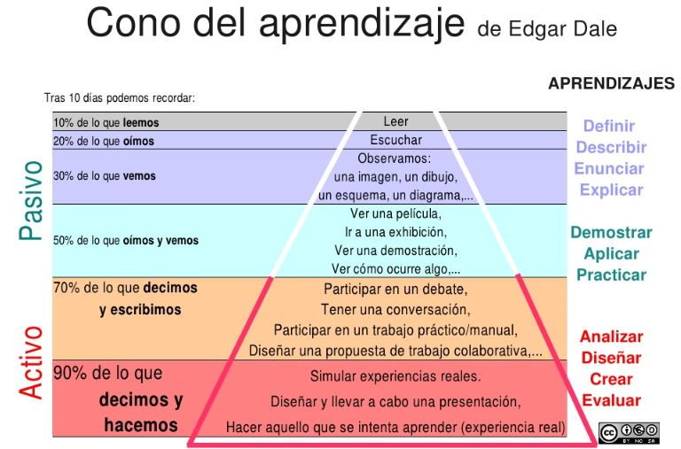

# M1. Empezando

¿conoces el siguiente gráfico?

<td style="text-align: center;">Fig. 1.1.: [Luis Orbegoso](http://luisorbegoso.blogspot.com.es/2013/03/el-cono-de-edgar-dale.html) CC</td>

No se trata de perder mucho tiempo con la explicación del gráfico, ya que entre otras cosas no está clara la evidencia científica de los porcentajes asignados, pero si de realizar una lectura:

"Tras 10 días, podemos recordar el 10% de lo que leemos y el 90% de lo que hacemos."

No sabemos si es una evidencia científica o no, pero la experiencia de muchos docentes es que hasta que no explicas un concepto o un contenido, no adquieres autentico dominio sobre él.

Por lo tanto, antes de explicar qué es esto de las HERRAMIENTAS DE ELABORACIÓN, hacemos esta pequeña reflexión sobre lo interesante de ELABORAR nuestros propios materiales, que según la pirámiede de Dale es la mejor forma de fijar los aprendizajes.

## Reflexión

¿Cúal es la diferencia entre Wikipedia y la Espasa? ¿Por qué ahora ya no usamos la Espasa?

<input class="feedbackbutton" name="toggle-feedback-20_9" onclick="$exe.toggleFeedback(this,true);return false" type="button" value="Mostrar retroalimentación"/>

### Retroalimentación

Esto daría para escribir una tesis doctoral, pero no se trata de eso, se trata de introducir un concepto ya muy conocido, el [hipertexto](http://es.wikipedia.org/wiki/Hipertexto) y compararlo con el [texto](http://es.wikipedia.org/wiki/Texto).

De Texto, casi todo el mundo podría dar una definición, aunque sólo sea por la gran cantidad de ellos que hemos manejado.

El hipertexto, es esencialmente el texto al que enriquecemos con enlaces (links) y este simple hecho le da una potencia de busqueda tremenda.

Piensa en cuando has buscado en un diccionario de papel. El tiempo de localizar la palabra no es pequeño. Con un enlace o link ese tiempo es instantáneo. Este dimple hecho hace inbatible a wikipedia frente a las enciclopedias clásicas de papel.

Los que estudiamos antes de la aparición de internet, estudiabamos en textos de papel. Cuando nos hemos dedicado a la docencia hemos empleado todo tipo de libros, textos, fichas o cuadernos de actividades.

La fotocopiadora ha sido el pilar central de la difusión de los apuntes o ejercicios que preparábamos y difundíamos a base de copiar y copiar.

Todo esos materiales eran textos.

Desde la irrupción de las TIC en el mundo educativo, los apuntes o los libros, quedan cortos comparado con algunos desarrollos didácticos sobre plataformas digitales.

Ya no solo podemos facilitar textos y apuntes, podemos facilitar, audios, videos, actividades interactivas, es decir enriquecemos notablemente los apuntes de toda la vida.

El problema surge con la dificultad de elaboración de estos nuevos materiales. Durante tiempo ha sido casi una labor heroica de gente que ha invertido cientos de horas de trabajo para resultados que luego tenían dificultades por la escasez de medios, por los problemas técnicos inherentes a este medio, etc.

Sin embargo estamos en un momento del desarrollo TIC, en el que la simplificación de las herramientas que elaboran materiales didácticos las hace accesibles, y la disponibilidad de recursos (ordenadores, conectividad, acceso de los alumnos a internet desde sus domicilios, etc.) ha crecido mucho.

Este curso trata de esto. De mostrar unas cuantas herramientas, de acceso libre, de funcionamiento sencillo, compatibles con estándares que se están imponiendo en Internet, de forma que los docentes puedan elaborar sus nuevos materiales didácticos empleando estas **HERRAMIENTAS DE ELABORACIÓN**.

 

## Objetivos

- Saber qué se que entendemos por herramienta de elaboración.
- Qué añaden a los materiales tradicionales, es decir los apuntes o los libros de texto
- Conocer las herramientas propuestas en el curso
- Saber instalar/utilizar dicas herrmientas
- Elaborar una primera unidad sencilla

 

