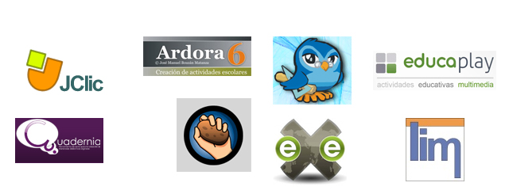

# M3 Otras herramientas de elaboración

En el primer módulo, hicimos una presentación de las herramientas que recopilamos en el curso, para conocer las interfaces de cada una y su forma de funcionamiento básica. La idea es que puedas hacerte una idea de cómo hay multiples formas de desarrollar una misma actividad.

En el módulo 2 variamos un poco la filosofía y nos centramos en una de las herramientas, eXeLearning, que por sus características, nos parece central en el curso.

**En este módulo recuperamos las otras actividades que presentamos en el módulo 1**. No se trata de "otras" en el sentido de menos importantes. Muchas de las herramientas de este módulo pueden sustituir completamente a eXeLearning. De hecho, muchas de ellas permiten hacer actividades que eXe no hace.

|Fig. 3.1. Logos de las herramientas que veremos en este módulo

 

En esta primera unidad te presentamos dos tablas/resumen, con objeto de que veas diferencias y similitudes, capacidades y deficiencias de cada herramieta.

La intención es que **reflexiones sobre qué tipo de actividades te interesa** hacer en función de tus necesidades. Tus intereses pueden depender de muchas cosas: alumnos más o menos mayores, materia que impartes, tipo de ordenadores que dispones y su configuración, etc.

Por todo esto, recomendamos leas con atención la Unidad 1 y revises, si es necesario, el módulo 1 para recordar lo fundamental de cada herramienta ya que hay una cosa importante que debes decidir: No es necesario que aprendas todas, no es necesario revises todos los apartados del módulo, debes **REFEXIONAR SOBRE QUÉ HERRAMIENTA TE PARECE MÁS INTERESANTE Y CON ESA HERRAMIENTA, HACER LAS ACTIVIDADES QUE SE INDIQUEN EN LA TAREA.**

Lógicamente, si te interesa más de una puedes usar varias, pero este módulo es interminable si nos acercamos a todas las herramientas.

# Objetivos

- Profundizar en las herramientas que se presentaron en el módulo 1
- Elegir la herramienta adecuada para la actividad
- Comprender que el mismo tipo de actividad puede realizarse desde herramientas distintas
- Preparar varias actividades en una web

# Importante

Si andas un poco perdido, recomendamos dos opciones tras leer la unidad 1:

- Consulta con el tutor, exponle tus intereses, dudas, etc.
<li>Acepta un consejo:
<ul>
- **Ardora **, es herramienta muy potente, que no precisa especial configuración del equipo más allá de navegador actualizado, **Ardora**  sólo en local pero tiene mucha variedad de actividades. Quizá esto te ayude en tu elección

