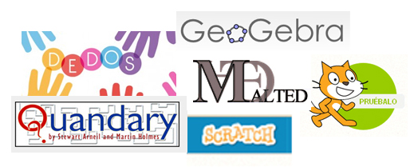

# M4. Herramientas específicas

Las herramientas que hemos aprendido a usar, no son específicas para una área o edad. Las podríamos denominar de **propósito general**, es decir, que lo mismo puede crearse una actividad para matemáticas en primaria que para lengua en bachillerato.

**Las herramientas que presentamos en este tema, son más específicas**. O se especializan en un tipo de actividad, o en una área, etc.

No se trata de aprender a utilizar cada una de ellas, pero si es interesante conocerlas ya que en general sisponen de bancos de recursos libres, ya confeccionados y que pueden ser reutilizados.

<td style="text-align: center;">Fig. 4.1. Herramientas específicas</td>

## Objetivos

- Conocer otras herramientas de autor, pero no "de propósito general" como las vistas hasta ahora, si no herramientas orientadas a un área o actividad específica.
- Buscar recurso realizados con estas herramientas y utilizarlos
- Saber instalar las aplicaciones, cuando sea necesario
- Conocer tutoriales donde poder aprender a manejar las aplicaciones

