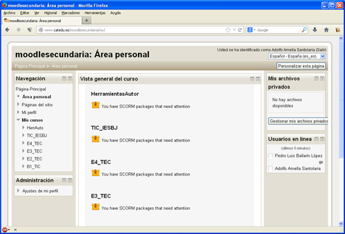

# M5. Publicar

Quizá este es el módulo más importante, ya que ¿Para qué hacer un ejercicio si no lo puedo **difundir o compartir**?

Para ello podemos publicar nuestra actividad de formas diferentes. Una de ellas ya la hemos utilzado. Se trata de de utilizar **Procomún**. Es un procedimiento muy sencillo y al final obtenemos un enlace público que podemos compartir con quienes vayan a utilizar nuestra actividad.

Pero este sistema no es el óptimo. Lo deseable es insertar nuestra unidad en una plataforma de e-Learning, como **Moodle**, ya que es un lugar donde podemos ir subiendo ODEs de distintos niveles de granularidad (recuerda el inicio del curso, en "Un poco de teoría")

En Moodle los profesores accedemos como creadores de contenidos y los alumnos se matriculan en nuestros cursos, ven y hacen nuestras actividades, incluyendo la posibilidad de controlar calificaciones y evolución del alumno.

<td style="text-align: center;">Fig. 5.1. Interfaz de Moodle.</td>

 

Además de estos sistemas, vamos a ver cómo compartir nuestras actividades en una red local, ya que en nuestro centro, en muchas ocasiones, no hay ancho de banda suficiente, y como alternativa, vamos a ver cómo **instalar un servidor** de páginas web, muy sencillo.

Por último, y aunque ya es meternos en terrenos de otros cursos como el de herramientas web 2.0,  o el de aprendizajd colaborativo con Blog,  muchos docentes usan **un blog, y si no un email**. Veremos como compartir nuestras actividades publicadas en internet con un blog o a través de un simple mensaje.

## Objetivos

- Preparar nuestras actividades para su publicación. Añadir Metadatos, autorías, etc.
- Integrar actividades elaboradas con diferentes herramientas para lograr una única.
- Publicar las actividades en Moodle
- Publicar las actividades en red local
- Compartir actividades a traves de otras herramientas (listas de correo o blogs)

