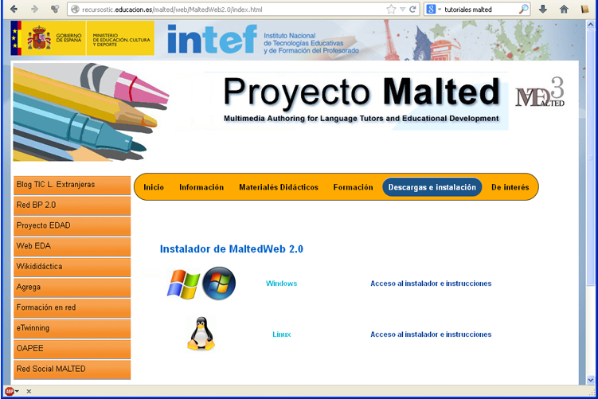
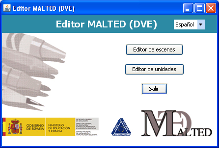
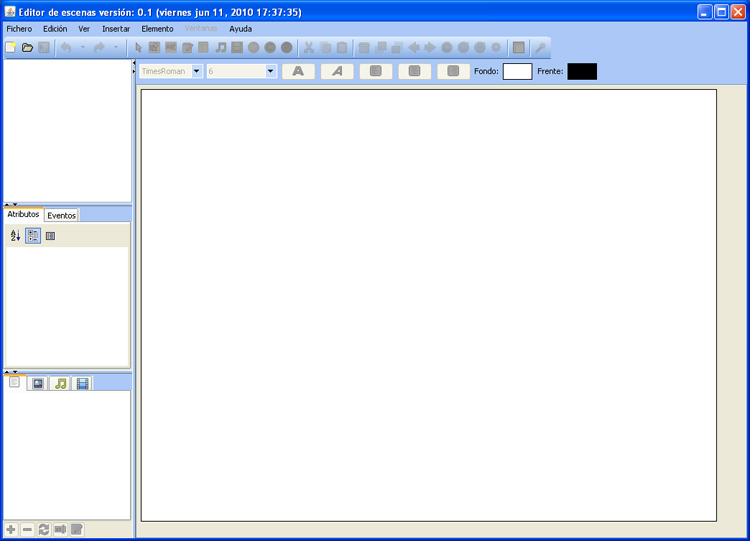
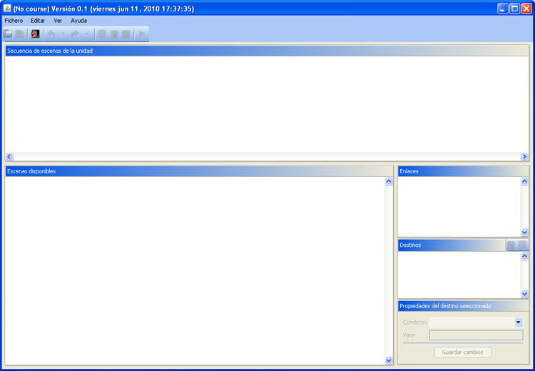

# Instalación MALTED

Para hablar de la instalación, de nuevo hay que centrarse en Java. Si tenemos instalada la versión que indica Malted en su web, en principio podemos ejecutar las unidades de Malted en el propio navegador.

Si la versión difiere, Malted no se puede ejecutar on-line, y la forma de ejecutar las unidades o actividades es descargarlas y ejecutarlas, en local, en el navegador de Malted que podemos instalarnos.

Para esta ejecución en local, [descargaremos el plugin de Malted, llamado MaltedWeb2.0](http://recursostic.educacion.es/malted/web/MaltedWeb2.0/index.html).

<td style="text-align: center;"> Fig 4.23. Web descargas MALTED</td>

Una vez instalado, podemos ejecutar la aplicación que tiene este aspecto:

<td style="text-align: center;"> Fig 4.24. Navegador MALTED</td>

Junto al Navegador Malted se instala también el Editor. La ventana del editor es la siguiente:

<td style="text-align: center;">  Fig 4.25. Editor MALTED</td>

Desde él podemos ir al editor de escenas, cuya interfaz es:

<td style="text-align: center;">     Fig 4.26. Editor de escenas MALTED</td>

Y por otro lado podemos ir al editor de unidades cuya ventana principal es la que se muestra en la imagen siguiente:

<td style="text-align: center;">  Fig 4.27. Editor de unidades MALTED</td>

