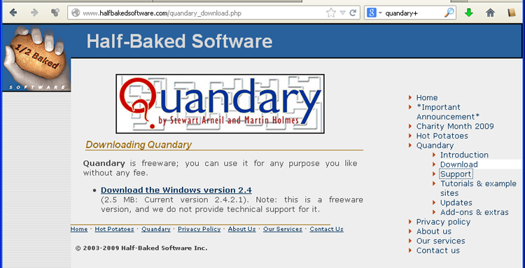

# Instalación Quandary

El instalador de [Quandary se descarga el apartado download de la web de Half-Baked Software](http://www.halfbakedsoftware.com/quandary_download.php), los mismos creadores de HotPotatoes.

La aplicación fue "discontinuada" en 2009, es decir ya no se actualiza ni se le da soporte, pero sigue a disposición de la comunidad la última versión, la 2.4.

<td style="text-align: center;">Fig 4.35. Web descargas Quandary</td>

El instalador se ejecuta y la interfaz de la aplicación, que es la de la siguiente imagen, es similar a las aplicaciones de HotPotatoes.

<td style="text-align: center;">Fig 4.36. Interfaz de Quandary</td>

 

 

