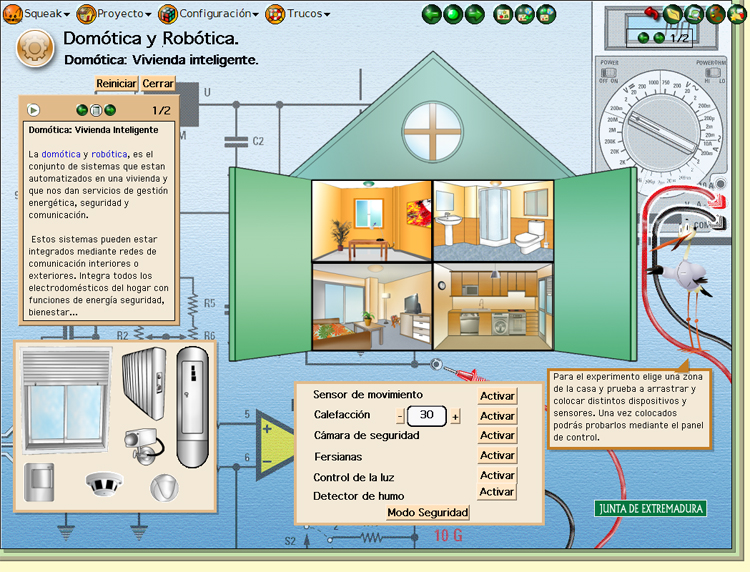

# Instalación y tutoriales Squeak

### Instalación

Podemos probar e instalar Squeak desde la [web oficial](http://www.squeak.org/), en la [sección de descargas](http://www.squeak.org/Download/).

Una vez descargado, ejecutado el instalador, podemos ejecutar el programa Squeak.

En Squeak, tenemos [varios ejemplos en la galería de proyectos](http://squeak.org/projects/).

Veamos un ejemplo del aspecto de un mundo virtual del área de Tecnología.

<td style="text-align: center;">Fig 4.40. Actividad de Squeak</td>

 

### Tutoriales

Como hemos comentado en diferentes ocasiones su uso no es especialmente intuitivo, pero si por cualquier causa nos interesa aprender a manejarlo, en la Web oficial de Squeak tenéis tutoriales: [Página de tutoriales](http://www.squeak.org/documentation/)

