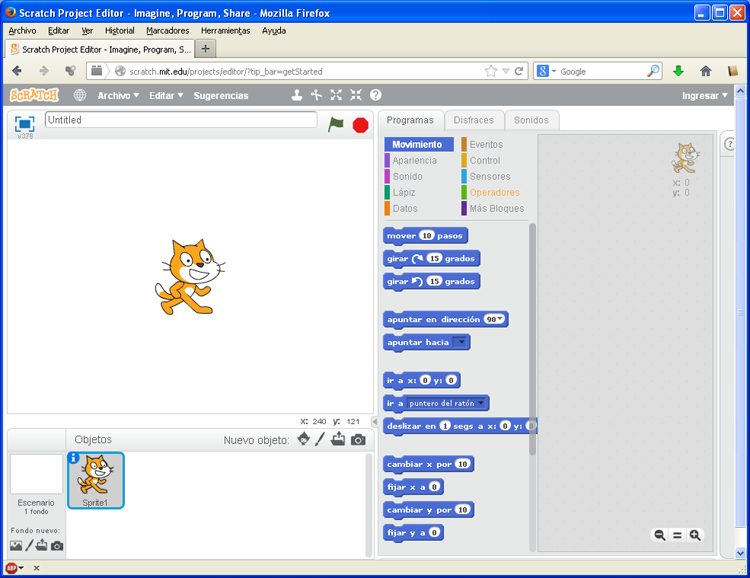

# Instalar SCRATCH

Recientemente SCRATCH ha incorporado una [versión on-line](http://scratch.mit.edu/projects/editor/?tip_bar=getStarted), que permite realizar nuestro proyecto directamente on-line. Para accecer hay que pulsar en la pestaña **Crear** de [la página de inicio](http://scratch.mit.edu/).

En la imagen se muestra la interfaz de Scratch

<td style="text-align: center;">Fig. 4.10. SCRATCH on-line</td>

 

Para instalar Scratch off-line solo tenemos que visitar la [página de descarga](http://scratch.mit.edu/scratch2download/) y seguimos las instrucciones.

