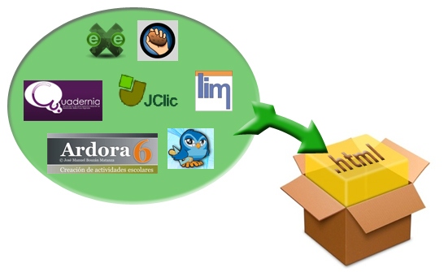

# Integrar actividades

Imaginemos que me siento cómodo utilizando eXeLearning cómo herramienta para mis actividades, pero que para preprarar test, prefiero usar HotPotatoes.

¿Puedo **incorporar mis test de HotPotatoes a** el resto de Actividades en **eXe**? Si, es posible.

La forma de hacerlo es, resumiendo, **exportar a Html** la actividad hecha con cualquier herramienta y luego i**ncorporar estos html a eXeLearning**.

**Constructor**, permite una **integración algo diferente**, que puede ser interesante, por lo que explicaremos cómo lo hace.

El objetivo es acabar con un único proyecto Html, en una carpeta.

<td style="text-align: center;">Fig. 5.5. Integrar en html</td>

