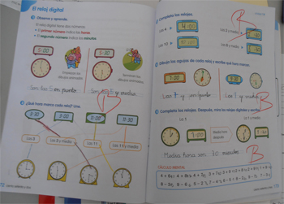
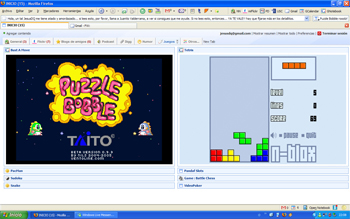
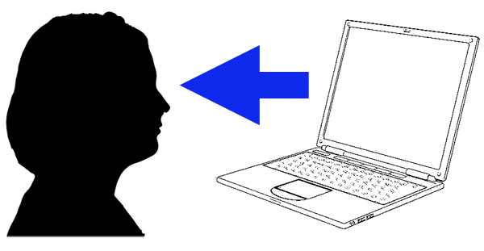
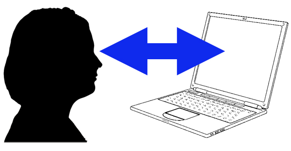

# Interactividad

## Actividad de lectura

Vamos a ver qué tipos de actividades hay. Para ello, piensa en un libro de ejercios, de los que acompañan a los libros de texto y por otro lado piensa en juego de ordenador.

Fig. 1.3. Libro de ejercicios. [Clase de Paco](http://clasedeprimariadepaco.blogspot.com.es/2012/05/viernes-11-de-mayo-de-2012.html). CC

Fig. 1.4. Actividad en un PC. [Jesús Domínguez](http://www.flickr.com/photos/jesusdq/). CC.</td>

¿Cuál es la diferencia?

%accordion%Solución%accordion%

### Retroalimentación

La diferencia es: **[LA INTERACTIVIDAD](http://es.wikipedia.org/wiki/Interactividad).**

La interactividad, definida sin precisión, es la posibilidad de interaccionar con el ejercicio. Cuando relleno un formulario en papel, no se si lo hago bien. Cuando relleno un formulario en una web, en muchas ocasiones me exige campos obligatorios y si no los relleno me impide su envío. Es decir hay interacción, si yo no lo hago como el formulario pide este me responde "nanay" y si completo todo los campos obligatorios dice ese mensaje tan habitual de "Su formulario se envió con exito"

### Actividad no interactiva.

La interactividad no depende del medio, depende de si tras ser realizada hay realimentación o no.

Se tiende a pensar que todo lo digital es interactivo y no es así. Si tu lees unos apuntes en pdf en la pantalla de un tablet, la situación es identica a leerlo en papel y es igual de **no interactivo**.

Por el contrario un papel o una pizarra de tiza, que en principio no es interactiva, si hay un profesor corrigiendo mientras el alumno escribe, si es una actividad interactiva ya que va informando al alumno si va bien o mal.

<td style="text-align: center;">
Fig. 1.5. Actividad no interactiva</td>

 

### Actividad interactiva

Será aquella actividad en la que el alumno tiene realimentación imientras hace la actividad.

<td style="text-align: center;">

Fig. 1.6. Actividad interactiva</td>

%/accordion%
