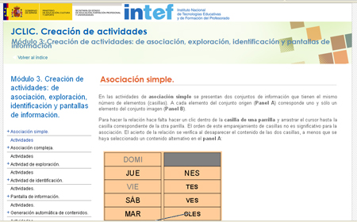

# JClic

Para hacer un **panel gráfico en JClic**, debemos utilizar la **actividad Asociación Simple**.

Para hacer una actividad de Java, deberemos ejecutar Jclic Author. Es posible que Java produzca un mensaje de seguridad, que deberemos aceptar.

Deberemos:

1. Iniciar un nuevo proyecto, dando un nombre al mismo
1. Vamos a la pestaña Actividades
1. Dentro de Actividades, vamos al botón nueva actividad
1. Una vez creada la nueva actividad, que en este caso será Asociación Simple
1. En la pestaña panel configuramos la actividad. No es especialmente intuitivo
1. Pulsamos en el botón de vista previa de actividad
1. Para Guardar, Jclic empaqueta todo en .zip, que luego puede ser editado en el propio Author

Veamos cómo:

<object data="http://aularagon.catedu.es/materialesaularagon2013/herramelabor/tm3/PG_Jclic.swf" height="600" style="display: block; margin-left: auto; margin-right: auto;" type="application/x-shockwave-flash" width="800"><param name="src" value="http://aularagon.catedu.es/materialesaularagon2013/herramelabor/tm3/PG_Jclic.swf"/></object>

# ParaSaberMas

Como hemos dicho, en JClic **no existe el panel gráfico** pero se puede hacer una actividad que cumple con los requisitos de panel gráfico y es la ASOCIACIÓN SIMPLE.

En el panel A cargamos una imagen y en el panel B las etiquetas, entonces ya tenemos la actividad Panel gráfico. Para más informaciónsobre esta actividad, [ver tutorial de asociación simple del INTEF.](http://www.ite.educacion.es/formacion/materiales/91/cd/m3/asociacin_simple.html)

Para más información/documentación sobre Jclic, visita el [tutorial íntegro del INTEF.](http://www.ite.educacion.es/formacion/materiales/91/cd/indice.htm)

<td style="text-align: center;">Fig. 1.3. Tutorial INTEF de JClic</td>

También en Facilytic, dispones de [documentación sobre JClic](http://www.catedu.es/facilytic/2013/05/03/jclic/).

