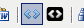

# Quandary

Para Quandary, podemos integrar de dos formas:

- Si la actividad está colgada en internet, y la insertamos con el idevice "Sitio web externo" o con el botón sitio web embebido y eligiendo tipo "iframe". Similar a como hemos hecho para ThatQuiz

<table align="center" border="2">
<tbody>
<tr>
|&lt;iframe src="carpeta/index.html" frameborder="0" height="600" scrolling="auto" width="800"&gt;&lt;/iframe&gt;
</tr>
</tbody>
</table>
 sutituyendo la ruta de la actividad (en rojo) por la realidad. Veamos cómo:</li>

 <object data="http://aularagon.catedu.es/materialesaularagon2013/herramelabor/tm4/exe_quandary.swf" height="600" type="application/x-shockwave-flash" width="800"><param name="src" value="http://aularagon.catedu.es/materialesaularagon2013/herramelabor/tm4/exe_quandary.swf"/></object>

 

