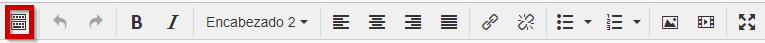

# Texto Libre

## Importante

## El editor de los iDevices de eXeLearning

Cuando abrimos uno de los iDevices en los que hay que introducir principalmente uno o varios textos, eXeLearning usa el editor [TinyMCE](http://es.wikipedia.org/wiki/TinyMCE). Un editor es un subprograma que se ejecuta para que podamos elaborar el contenido de la actividad.

TinyMCE es un [editor de texto](http://es.wikipedia.org/wiki/Editor_de_texto) [WYSIWYG](http://es.wikipedia.org/wiki/WYSIWYG) para [HTML](http://es.wikipedia.org/wiki/HTML) de [código abierto.](http://es.wikipedia.org/wiki/C%C3%B3digo_abierto)

WYSIWIG es el acrónimo de ****W**hat **Y**ou **S**ee **I**s **W**hat **Y**ou **G**et** (en español, "lo que ves es lo que obtienes"). Se aplica a los procesadores de texto y otros editores de texto con formato (como los editores de HTML) que permiten escribir un documento viendo directamente el resultado final.

En el siguiente tutorial, procuramos explicar cómo hacer lo más habitual que hacemos en el tratamiento de un texto, utilizando TinyMCE (Es del 2014 pero es igual, simplemente que los botones han cambiado de aspecto)

<object data="http://aularagon.catedu.es/materialesaularagon2013/herramelabor/tm1/tiny_edicion.swf" height="600" type="application/x-shockwave-flash" width="800"><param name="src" value="http://aularagon.catedu.es/materialesaularagon2013/herramelabor/tm1/tiny_edicion.swf"/></object>

En el siguiente tutorial, puedes ver como utilizar tablas, insertar vídeos o imágenes, utilizando el editor Tiny:

<object data="http://aularagon.catedu.es/materialesaularagon2013/herramelabor/tm1/tiny_tab_mmedia.swf" height="600" type="application/x-shockwave-flash" width="800"><param name="src" value="http://aularagon.catedu.es/materialesaularagon2013/herramelabor/tm1/tiny_tab_mmedia.swf"/></object>

