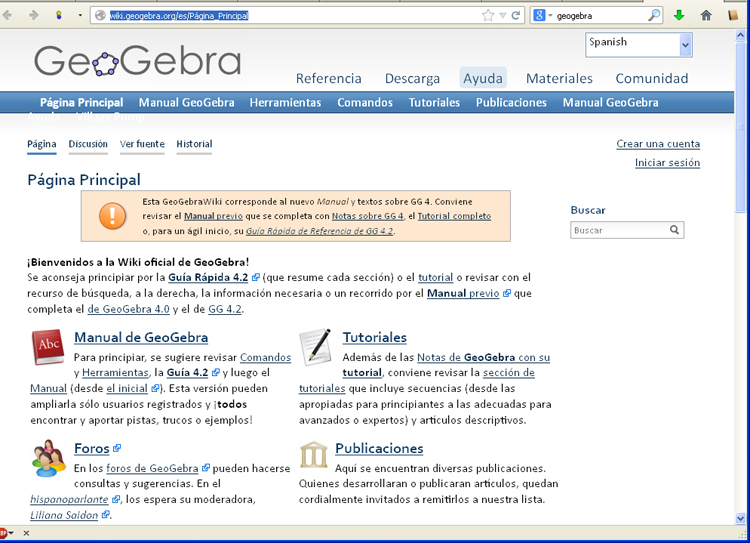

# Tutoriales de GeoGebra

La web de GeoGebra tiene un apartado de [ayuda](http://wiki.geogebra.org/es/P%C3%A1gina_Principal) (que es una [Wiki](http://es.wikipedia.org/wiki/Wiki), es decir una enciclopedia sobre Geogebra) en la que hay mútiples manuales, guías rápidas y referencias.

En la [ayuda](http://wiki.geogebra.org/es/P%C3%A1gina_Principal) recomiendan empezar por una [guía rápida](http://www.geogebra.org/help/geogebraquickstart_es.pdf), que nos hace una introducción a la aplicación en pdf.

<td style="text-align: center;">Fig. 4.7. Wiki de GeoGebra</td>

También existe un [canal de video tutoriales en YouTube](http://www.youtube.com/user/GeoGebraChannel), pero que están en inglés (aunque en ocasiones el audio no es vital para seguir la explicación).

Un ejemplo cualquiera de este tutorial es el siguiente:

https//www.youtube.com/watch?v=2NqblDIPl38

