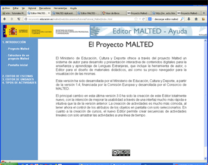

# Tutoriales MALTED

Hay **tutoriales Malted** en diversos formatos. Los hay en pdf, html o flash.

En el caso de la web de Malted, he de ir al apartado: De Interés&gt;Tutorial Malted.

<td style="text-align: center;"> Fig 4.28. Tutoriales MALTED</td><td style="text-align: center;">Fig 4.29. Estructura proyecto MALTED</td>

También hay disponibles [tutoriales multimedia](http://recursostic.educacion.es/malted/web/documentos/tutorial/multimedia/index.htm), realizados en flash (para lo cual es preciso tener el [plugin de Flash](http://get.adobe.com/es/flashplayer/) instalado) que nos van guiando paso a paso.

También en esta [página de educamadrid](http://www.educa2.madrid.org/web/max/documentacion/max6/guia_de_referencia/educacion/entorno_malted/-/book/entorno-malted?controlPanelCategory=portlet_book_viewer_WAR_cms_tools&amp;_book_viewer_WAR_cms_tools_chapterIndex=f591c13a-c621-48e8-a954-94ea3668e040&amp;showCover=true), ofrece un tutorial de Malted, tanto en html, como en pdf.

