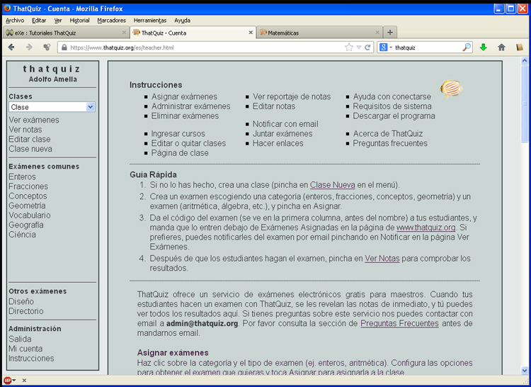
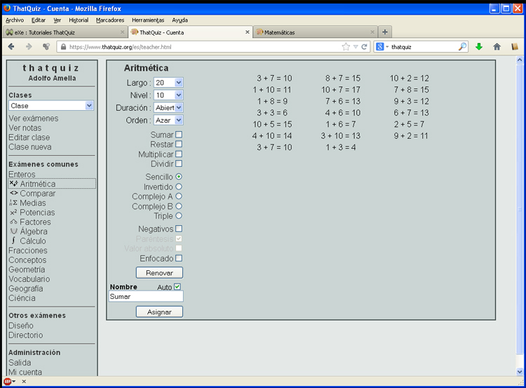
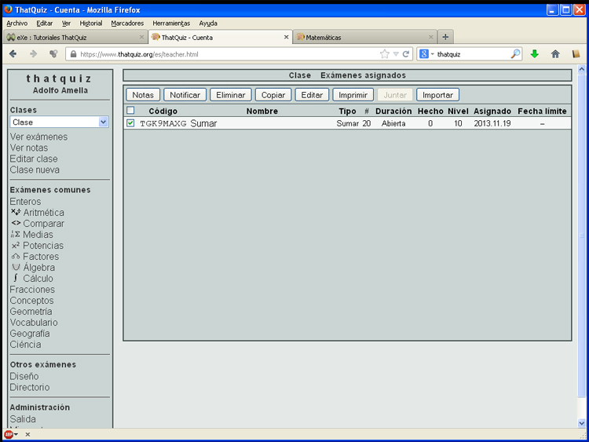

# Tutoriales ThatQuiz

Si nos identificamos con usuario/contraseña en Thatquiz, accedemos a la parte de edición y directamente nos muestra las intruciones de uso.

El aspecto es el siguiente:

<td style="text-align: center;">Fig. 4.16. Edición de actividades en ThatQuiz</td>

La columma de la izquierda es el **panel de control de la aplicación**. Por ejemplo, Si vamos a:

Exámenes comunes &gt; Enteros

Se despliegan más opciones. Si elegimos Aritmética, nos lleva a realizar/configurar sobre aritmética. Este creador de exámenes tiene este aspecto:

<td style="text-align: center;">Fig. 4.17. Creador de exámenes en ThatQuiz</td>

Al pulsar Asignar se crea la prueba/exámen

<td style="text-align: center;">Fig. 4.18. Lista de actividades en ThatQuiz</td>

Es muy inteseante el **código**. El alumno, al teclearlo en la web de inicio, le aparece directamente la prueba. Facilitando a los alumnos la web y el código, en muy poco tiempo, en muy pocos pasos, hemos conseguido hacer pruebas para los alumnos

