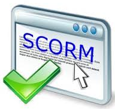

# U1.1 OJO

## No seas un brut@

NO TIENES QUE APRENDER TODAS LAS HERRAMIENTAS

Pero sí que tienes que aprender la herramienta que necesitas para tus actividades

Si tienes un lío, te recomendamos ARDORA por la tecnología y por la gran variedad de tipo de actividades que ofrece.

NO RECOMENDAMOS TECNOLOGÍA FLASH **[[ver](http://www.elmundo.es/blogs/elmundo/el-gadgetoblog/2017/07/25/adobe-acabara-con-flash-en-2020-10-anos.html)]** o sea **no** recomendamos LIM, Cuadernia y Constructor.

¿Recuerdas la pizza? Una propuesta es que la base sea Exelearning, pero como le falta actividades, le pondremos otras elaboradas con otras herramientas.

Una base enriquecida a tu gusto está deliciosa !!!

