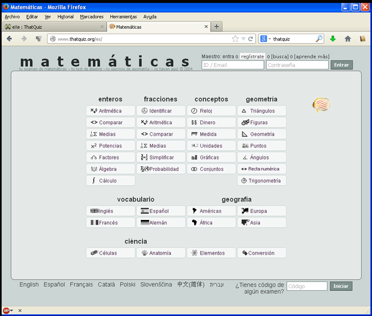

# U1.2 ThatQuiz

En la web de [ThatQuiz](http://www.thatquiz.org/es/), explican que esta herramienta facilita generar ejercicios y ver resultados de manera muy rápida. En particular, es buena herramienta para la enseñanza de las matemáticas.

La interfaz de esta herramienta on-line es la que se muestra en la siguiente imagen. Se trata de una aplicación de uso sencillo, pero que ha quedado algo **anticuada** o **desactualizada**, aunque lo que hace, lo hace muy bien de forma bastante sencilla.

<td style="text-align: center;">Fig. 4.15. Web de ThatQuiz</td>

Es **importante registrarse como usuario** (enlace **registrate** en la parte superior derecha), ya que una vez identificados, accedemos a la zona de edición donde además se muestran las instrucciones.

