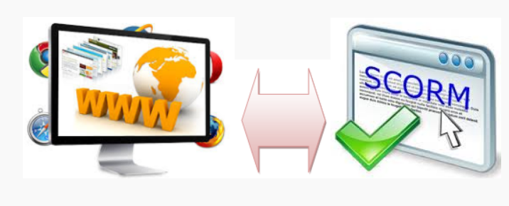

# U1. Cuándo se necesita cada forma de publicar

A lo largo del curso hemos finalizado muchas actividades exportando en .hmtl, en formato web, con el objetivo de que los usuarios de la actividad la puedan utilizar a través del navegador.

Pero esta no es la única posibilidad de exportación. Casi todas la herramientas que hemos visto, dan la posibilidad de exportar a formato [SCORM](http://es.wikipedia.org/wiki/SCORM). Este formato es el que admiten los [LMS](http://es.wikipedia.org/wiki/Sistema_de_gesti%C3%B3n_de_aprendizaje), es decir los gestores de cursos como Moodle.

 ¿Cuándo es conveniente utilizar cada uno de las formas de exportación? Veamoslo: 

### El paquete Web

**Esta parte la hemos ido utilizando **a lo largo del curso. **En esta Unidad** vamos a ver cómo, además de poder hacer colecciones de actividades "sueltas", podemos darles coherencia en una unidad. Vamos a **integrar actividades**.

Por ejemplo: Imaginemos que tenemos unos test realizados con HotPotatoes y otros ejercicio realizados con Lim. Supongamos que son ejercicios para practicar a partir de una explicación teórica que has preparado en eXeLearning. Pues bien, en vez de tener 3 actividades, podemos integrar, por ejemplo, las actividades realizadas con LIM y HorPotatoes en el eXeLearning que contiene la teoría. Y así dejarlo todo en un sólo ODE.

Además algunas herramientas de incorporarles Metadatos. Los Metadatos son etiquetas, o explicaciones que añadimos a nuestro proyecto para que si compartimos nuestra actividad en un contenedor de contenidos educativos, pueda ser localizado. Estos Metadatos, pueden seguir distintas estandarizaciones. También veremos cómo añadir Metadatos en algunas herramientas a lo largo de este módulo.

Es decir, además de lo que ya hemos ido haciendo en el curso, aprenderemos a dar los "ultimos retoques" a nuestro ODE, pero finalmente lo que vamos a **obtener es lo que hemos ido denominando un paquete html**. Sea comprimido (en formato .zip) o descomprimido (una carpeta con todos los componentes de la web que se ha creado al exportar Web), tenemos el paquete html, listo para publicar y utilizar en cualquier navegador.

### El paquete SCORM

Como vimos en el módulo 1, en "Un poco de teoría" , un objeto SCORM es un formato estandar de preparar ODEs para su publicación en un LMS, como pueda ser Moodle.

Concretando, es **una forma de exportar la actividad** que he realizado con alguna de las herramientas del curso, **para subirla a Moodle**.

En este módulo vamos a ver cómo crear el paquete SCORM con las aplicaciones que lo permiten. Lo cual no quita para que las "técnicas" que hemos aprendido para crear un paquete web (es decir, integrar o poner Metadatos) no puedan ser aplicadas en paquetes SCORM. Reordemos que la exportación es lo último que hacemos, lo que hacemos cuando ya la actividad está ya lista.

Por tanto, **exportar en formato SCORM lo usaremos cuando queramos** que el objetivo de nuestro ODE, de nuestras actividad, sea ser alojado en un LMS como **Moodle.**

### Ventajas e inconvenientes

¿Cómo decidir qué tipo de exportación me intesesa usar? Vamos a vez algunas diferencias, ventajas e inconvenientes de cada caso:

#### Empaquetado web

Como bien sabes, cualquier ordenador o dispositivo móvil lleva un navegador, y con aplicaciones como drive o dropbox es realmente sencillo publicar en internet.

Es decir, **es una forma muy versatil de generación de actividades o materiales curriculares.**

Entre sus inconvenientes, por un lado, que la conexión a internet en los centro educativos no siempre es buena, lo que podemos suplir publicando el paquete web en la red local del centro.

Por otro lado, en el caso de que los alumnos empleen directemente las actividades nos impide llevar un control o evaluación de sus avances, ya que no quedan registrados en ninguna parte las calificaciones, ajercicio realizados etc.

#### Empaquetado SCORM

Cuando tengamos una actividad empaquetada en SCORM, para publicarla, e preciso alojarla en un LMS.

Nosotros usaremos Moodle como aplicación LMS.

Por tanto necesitaremos tener un curso moodle activo (por ejemplo en Catedu). Allí alojamos nuestro ODE exportado en SCORM.

Los alumnos deben matricularse en el curso y acceder con su usuario y contraseña. Una vez identificados acceden al curso, y Moodle lleva la cuenta de si ha relizado la o las actividades y en el caso de que sear una actividad tipo SCORM, almacena la calificación.

Hay que pensar que Moodle se usa en formación a distancia, y allí es importante saber que hace el alumno, ya que no lo ves presencialmente. Es decir,** Moodle nos interesará cuando deseemos cierto control sobre la evolución del alumno**.

Por tanto, en este caso las actividades se realizan también a través de navegador web, pero previo acceso a Moodle.

### Conclusión

Para elegir qué tipo de exportación, l**o fundamental es plantearse  si queremos que sea un sistema de acceso restringido y con control o abierto y sin reflejo de la evolución y calificaciones que los alumnos van obteniendo en cada actividad.**

En el **primer caso**, acceso controlado, optaremos por exportar en SCORM y darmos de alta un **Moodle**

En **el otro caso**, acceso abierto, optaremos por la exportación en **Web**.

### No son incompatibles

Podemos poner nuestros contenidos como una página WEB en una plataforma LMS como Moodle y en Moodle poner actividades tipo test, entregas, tareas.. así están realizados los cursos en Aularagón, para permitir más versatilidad y facilitar el mantenimiento.

También, podemos empezar usando Web y acabar creando un SCORM. Sólo hay que tomar la decisión antes en herramientas que no permiten exportación SCORM, como JClic.

 

