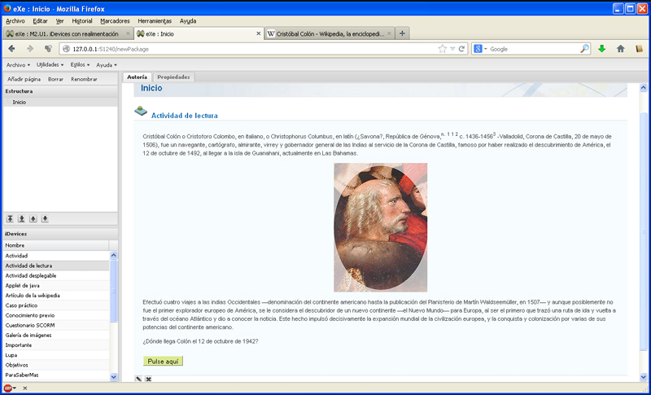

# U1. iDevices con realimentación

Vamos a emplear iDevices que permiten una pequeña interacción con el usuario, el alumno del curso on-line. Son los iDevices:

- Actividad de lectura
- Caso Práctico
- Reflexión

Se trata esencialmente de unas actividades en las que un botón añade información de realimentación, que el usuario puede utilizar o no.

<td style="text-align: center;">Fig. 2.1. Actividad con realimentación en eXeLearning</td>

