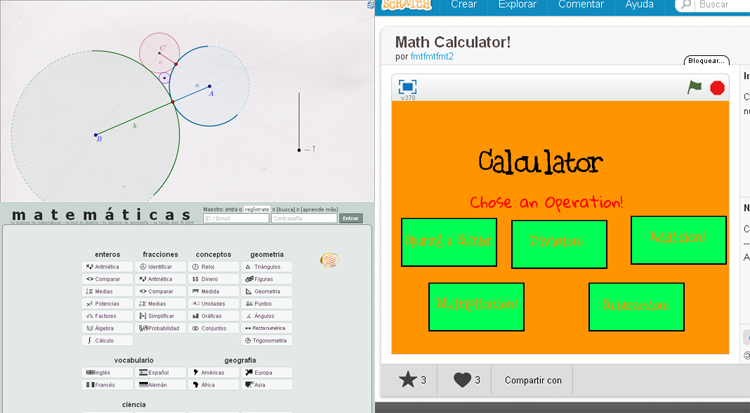

# U1. Matemáticas / Ciencias

Hemos agrupado Geogebra y ThatQuiz, bajo el epígrafe Matemáticas / Ciencias, aunque no sólo pueden usar para matemáticas.

**Geogebra** si es una aplicación directamente pensada para explicar matemáticas, pero puede resultar útil siempre que tengamos que explicar gráficas, curvas, funciones, etc. En física, ciencias naturales o geografía, puede resultarnos de interés. Pero también para por ejemplo, dibujo técnico, donde la geometría puede ser mostrada por Geogebra, ayudandonos en las explicaciónes.

**ThatQuiz**, en su propia Web se anuncia que es una herramienta para las matemáticas, pero al tratarse de una aplicación para elaborar diferentes tipos de ejercicios, sirve para otros temas. En la web de la aplicación hay ejemplos de Ciencias, geografía o vocabulario.

<td style="text-align: center;"> Fig. 4.4 Herramientas para matemáticas y ciencias</td>

