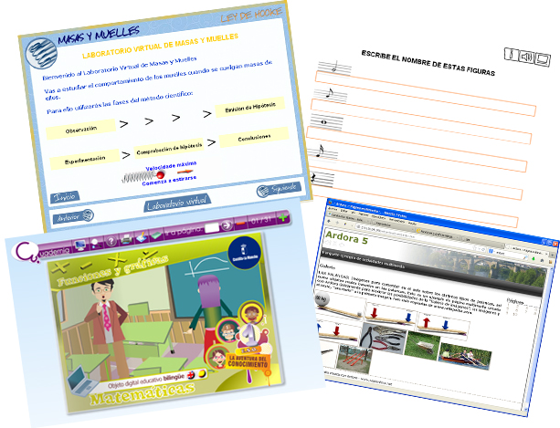

# U1. Tipos de actividades

Para poder decidir que actividad quiero usar, vamos a intentar resumir ó presentar la información sobre todas las herramientas de elaboración que vamos a tratar en el curso.

Para ello, por un lado comparamos su [características generales](caratersticas_generales.html) (Tipo instalación, tecnología, etc.) y por otro lado, en función de qué [tipos de actividades](actividades.html) o idevices permite desarrollar cada herramienta.

<td style="text-align: center;"> Fig 3.1. Actividades creadas con distintas herramientas</td>

