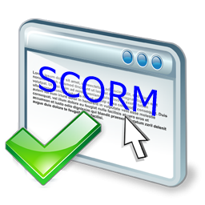

# U1. Un poco de teoría

# El e-Learnig

El [Aprendizaje Electrónico o e-Learning](http://es.wikipedia.org/wiki/E-learning) (su denominación original en inglés) es como se denominó a el educación a distancia completamente virtualizada a través de los nuevos canales electrónicos, fundamentalmente Internet.

Este concepto se utiliza no sólo en la educación a distancia, y se emplea también para todo el soporte electrónico de la enseñanaza presencial, en lo que se ha definido como [b-learning](http://es.wikipedia.org/wiki/Blended_learning) (blended-learning)

Como siempre que se produce un desarrollo tecnológico, y el e-learning puede ser considerado como tal, este lleva asociado una **terminología que nos ayuda a entender qué es o cómo se trabaja con el e-Learning**.

|Fig. 1.2. SCORM, un estandar de e-Learning

 

Vamos a ver unas cuantas definiciones. No se trata de memorizarlas, ni de hacer disquisiciones teóricas. El objetivo es entender el concepto, por si nos referimos a él, saber de qué estamos hablando.

 Nos centramos en:

- Actividades según la interactividad
- Definir Terminología derivada el e-Learning
- Tipos de actividades

