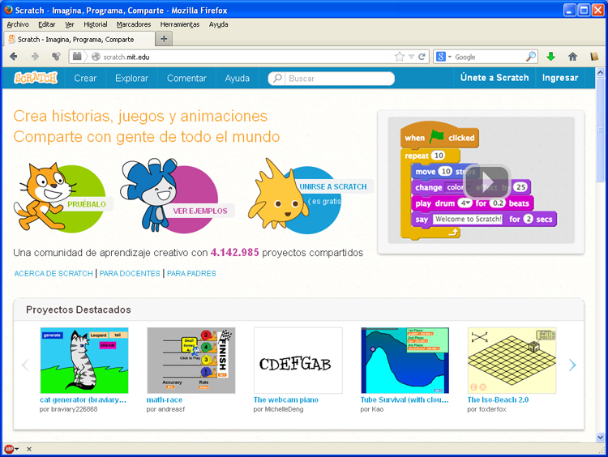

# U2 Programación Scratch

[Scratch](http://scratch.mit.edu/) es un entorno de programación donde crear nuestras propias historias interactivas, juegos y animaciones

Facilita también compartir sus creaciones con otros en internet.

Scratch es un proyecto del [Grupo Lifelong Kindergarten](http://llk.media.mit.edu/) del Laboratorio de Medios del MIT y se ofrece de forma gratuita.

<td style="text-align: center;">Fig. 4.9. Web de SCRATCH</td>

