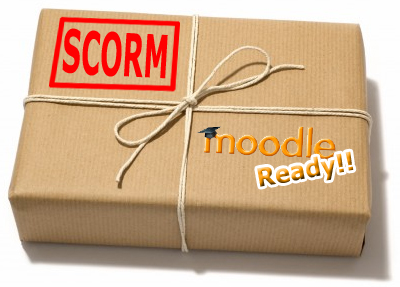
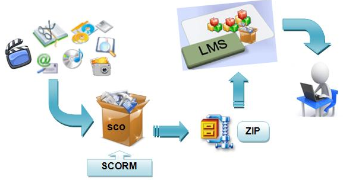

# U3. Crear el paquete SCORM

Como vimos al principio del curso, un objeto [SCORM](http://es.wikipedia.org/wiki/SCORM) es un conjunto de **estándares y especificaciones** que permite crear objetos pedagógicos estructurados.

Mas allá de qué es exactamente un SCORM, lo que nos interesa a nosotros es que, SCORM es el formato al que debemos exportar para poder subir nuestro proyecto o curso con actividades a una plataforma [LMS](http://es.wikipedia.org/wiki/Sistema_de_gesti%C3%B3n_de_aprendizaje), como por ejemplo **Moodle**.

Desde [Catedu](http://catedu.es/webcatedu/) podemos [solicitar un curso Moodle](http://soporte.catedu.es/) para alojar nuestras actividades.

Vamos a ver cómo **obtener los paquetes SCORM en distintas aplicaciones**, para en la próxima unidad ver cómo alojarlos en Moodle.

<td style="text-align: center;">Fig. 5.7. Preparamos el paquete SCORM</td>

 

