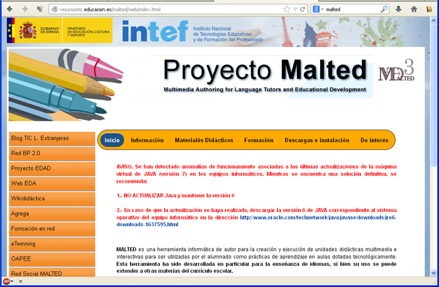

# U3. Idiomas / MALTED

MALTED, es descrita en su web como, una herramienta informática de autor para la creación y ejecución de unidades didácticas multimedia e interactivas para ser utilizadas por el alumnado como prácticas de aprendizaje en aulas dotadas tecnológicamente. Esta herramienta ha sido **desarrollada en particular para la enseñanza de idiomas**, si bien su uso se puede extender a otras materias del currículo escolar.

Al estilo de JClic, MALTED está integrado en dos entornos:

- El de **autor**, para la creación y maquetación de las unidades
- El de **edición**, para la ejecución y utilización de las unidades

La imagen siguiente muestra el aspecto de la [web de inicio de MALTED](http://recursostic.educacion.es/malted/web/index.html). En ella vemos ya el principal problema de MALTED, que es el ocasionado por JAVA y los problemas de las últimas actualizaciones de Java.

<td style="text-align: center;">Fig 4.22. Web proyecto MALTED</td>

 

 

