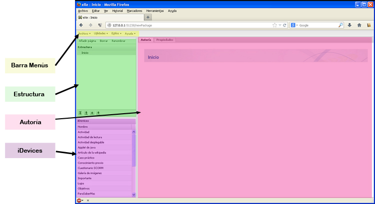

# U4. Primeros pasos con eXeLearning

Vamos a detenernos en explicar con un poco de detalle una de las aplicaciones que hemos ido presentando. Se trata de eXeLearning.

Haremos un breve recorrido sobre la interfaz de la aplicación y veremos como preparar una actividad sencilla.

Hemos visto cómo se instala eXeLearnig, y suponemos que ya lo tenemos instalado. Vamos a realizar primero un repaso de la interfaz de eXeLearning

<td style="text-align: center;">Fig. 1.7. Interfaz de eXeLearning</td>

<li>[Barra de herramientas](barra_de_herramientas.html)
<ul>
- Archivo
- Utilidades
- Estilos
- Ayuda

- Añadir página / Borrar / renombrar
- Flechas

- Pestaña Autoría
- Pestaña Propiedades

- Están todos los tipos de actividad

