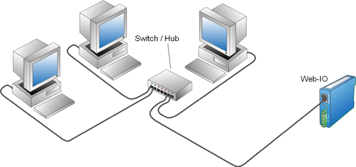

# U5. Publicar en local

En el caso de querer publicar en local, también es posible publicar la actividad como una web y dentro de un Moodle.

En ambos casos es preciso instalar un servidor en nuestra red, pero en el caso de Moodle, además hay que instalar y configurar Moodle, lo cual puede no ser sencillo.

El caso de querer instalar un ODE en formato SCORM en un **Moodle instalado en local** en nuestro centro, lo dejaremos para el caso de que nuestro centro disponga de este servicio, aunque presentaremos algún Moodle fácilemente instalable por si queremos experimentar.

Fig. 5.9. Red Local. Autor: [OkPcBarcelona](http://www.okpcbarcelona.com/redes-lan.php%20). Lic. Creative Commons

