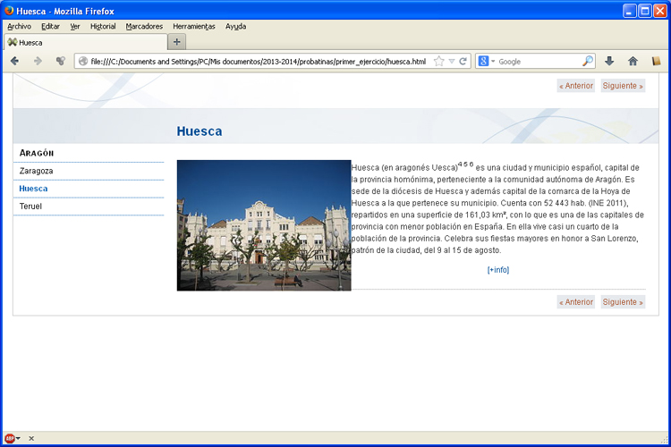

# U5. Una primera actividad

Vamos a elaborar una unidad sencilla con eXeLearning.

Con las técnicas que hemos ido viendo vamos a realizar una actividad no interactiva.

<td style="text-align: center;"> Fig. 1.8. Actividad no interactiva, realizada con eXeLearning</td>

