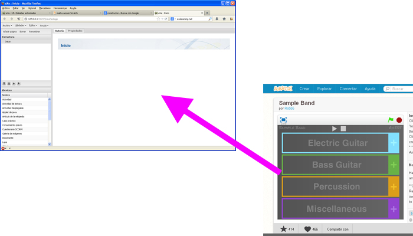

# U6. Embeber actividades

Si queremos embeber, insertar o incorporar, a un proyecto que estamos realizando con una herramienta (por ejemplo eXeLearning) algo realizado con otra herramienta (una de las que hemos visto en este módulo, por ejemplo SCRATCH, Geogebra o alguna de las del módulo 3)

Para ello, nos aprovechamos de que en general, las actividades "se terminan" exportando en html.

**eXeLearning y otras muchas herramientas permiten incrustar cualquier html** (por lo tanto, cualquier actividad exportada) en nuestro proyecto.

Es una forma de combinar herramientas en una sóla.

<td style="text-align: center;">Fig. 4.44. Integrar SCRATCH en eXe</td>

